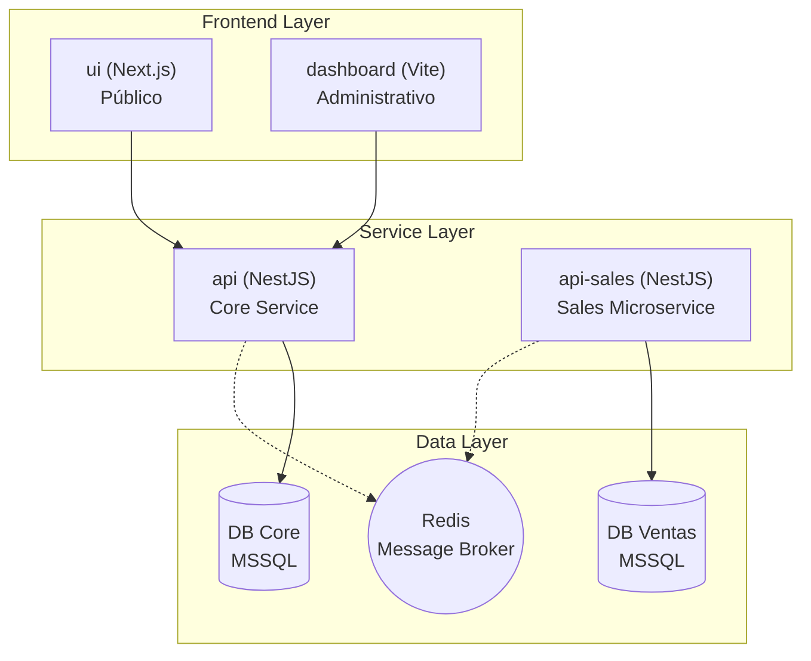

# Arquitectura del Sistema - Entrafesa

Este documento describe la arquitectura actual del proyecto **Entrafesa**, un sistema monorepo diseñado para la gestión de transporte y ventas.

## 🏗️ Visión General de la Arquitectura

El proyecto está estructurado como un **monorepo** gestionado con `pnpm` y `turbo`, lo que permite compartir código (como DTOs) entre diferentes servicios y aplicaciones. La arquitectura se basa en una separación clara entre el núcleo administrativo y el módulo de ventas, operando sobre bases de datos independientes.

---

## 🚀 Componentes del Sistema

### 1. Frontends

- **`ui` (Next.js):** Aplicación principal orientada al usuario final (público). Utiliza Next.js para renderizado eficiente y SEO. (Anteriormente referenciada como `web`).
- **`dashboard` (Vite):** Panel administrativo para la gestión de agencias, buses, rutas y usuarios. Construido con React y Vite.

### 2. Backends (Servicios)

- **`api` (NestJS):** El servicio principal ("Core"). Maneja la lógica de negocio fundamental:
  - Gestión de Agencias, Buses, Asientos, Destinos, Galería, Autenticación y Usuarios.
- **`api-sales` (NestJS):** Un microservicio dedicado exclusivamente al proceso de ventas.
  - Utiliza un transporte de **Redis** para la comunicación.
  - Tiene su propia lógica de negocio aislada.

### 3. Shared Packages

- **`packages/dtos`:** Contiene las definiciones de transferencia de datos compartidas.

---

## 🗄️ Estrategia de Bases de Datos

El sistema implementa una **segregación de bases de datos** para optimizar el rendimiento y el aislamiento:

1.  **Base de Datos Core (`api`):** Almacena la configuración maestra y operativa del sistema administrativo.
2.  **Base de Datos de Ventas (`api-sales`):** Configurada para manejar transacciones de ventas de forma independiente.

Esta separación asegura que el núcleo administrativo (`api`) y el módulo de ventas (`api-sales`) no compitan por recursos a nivel de base de datos, facilitando el mantenimiento y la escalabilidad independiente.

---

## 🛠️ Stack Tecnológico

- **Lenguaje:** TypeScript.
- **Framework Backend:** NestJS + TypeORM.
- **Base de Datos:** Microsoft SQL Server (MSSQL).
- **Framework Frontend:** Next.js y React/Vite.
- **Comunicación:** REST API y Redis.
- **Gestión de Monorepo:** TurboRepo + pnpm.

---

## 🧩 Patrones de Diseño e Ingeniería de Calidad

Para un análisis más profundo sobre la construcción del sistema, consulte los siguientes documentos:

- [Patrones de Diseño](file:///c:/Users/laszlo/Downloads/uni/admin/entrafesa/DESIGN_PATTERNS.md): Singleton, Factory, Repository, etc.
- [Aprendizaje del Equipo](file:///c:/Users/laszlo/Downloads/uni/admin/entrafesa/TEAM_LEARNING.md): Reflexiones sobre las herramientas y habilidades desarrolladas.
