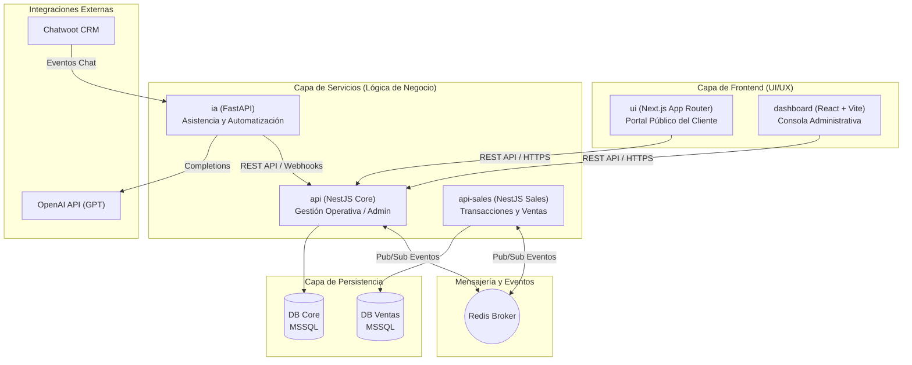

# Documentación Técnica Completa - Proyecto Entrafesa

Este documento proporciona una especificación técnica y de arquitectura sumamente detallada sobre el monorepo del sistema de Entrafesa, desarrollado para la gestión operativa, comercial (ventas) y atención al cliente integrada con inteligencia artificial.

---

## 1. Arquitectura General y Topología del Sistema

El sistema está estructurado bajo una arquitectura de Monorepo gestionado con pnpm y turborepo. La topología se divide en capas bien definidas para asegurar escalabilidad, alta cohesión y bajo acoplamiento.

### Diagrama de Arquitectura



---

## 2. Estructura de Directorios (Monorepo)

A nivel de raíz, el proyecto utiliza la siguiente estructura organizada de paquetes y configuraciones globales:

```text
entrafesa/
├── api/                  # Backend Core - NestJS (Gestión Operativa)
├── api-sales/            # Microservicio de Ventas - NestJS
├── dashboard/            # Frontend de Administración - React + Vite
├── ui/                   # Frontend de Usuario Final - Next.js
├── ia/                   # Servicio de Inteligencia Artificial - FastAPI + Python
├── packages/
│   └── dtos/             # DTOs y tipos compartidos TypeScript
├── package.json          # Configuración de workspaces y dependencias de desarrollo raíz
├── pnpm-workspace.yaml   # Declaración de paquetes del monorepo
├── turbo.json            # Configuración de pipelines de compilación y caché con Turbo
└── README.md             # Guía rápida de inicio
```

---

## 3. Especificación de los Servicios y Aplicaciones

### 3.1 api (NestJS Core Service)
Es el núcleo administrativo del sistema. Administra la infraestructura básica, flota y base operativa del negocio.
*   **Tecnologías:** NestJS, TypeORM, TypeScript.
*   **Base de Datos:** MSSQL (Base de Datos Central DB Core).
*   **Responsabilidades:**
    *   **Autenticación y Seguridad:** Control de acceso basado en roles (RBAC) y emisión de JSON Web Tokens (JWT).
    *   **Gestión de Agencias (agency):** Oficinas físicas, puntos de embarque y desembarque.
    *   **Gestión de Buses (bus):** Flota de buses, asignación de pisos, configuración física de asientos y estado operativo.
    *   **Destinos y Rutas (destination):** Configuración de itinerarios, precios y tiempos estimados de viaje.
    *   **Reservas (reserver):** Procesamiento inicial y retención temporal de asientos.
    *   **Galerías (galery):** Catálogos multimedia y fotos de las flotas.
    *   **Notificaciones (notifications):** Alertas push y masivas para usuarios y personal de operaciones.

### 3.2 api-sales (NestJS Sales Microservice)
Un microservicio autónomo enfocado en la lógica transaccional y financiera de ventas.
*   **Tecnologías:** NestJS, TypeORM, TypeScript, Redis Microservice Transporter.
*   **Base de Datos:** MSSQL (Base de Datos Independiente DB Ventas).
*   **Responsabilidades:**
    *   **Procesamiento de Compras (sales):** Generación de transacciones, tickets electrónicos e integraciones con pasarelas de pago.
    *   **Promociones (promos):** Validación y aplicación de cupones de descuento sobre ventas activas.
    *   **Fidelización (points-user):** Registro de puntos acumulados por viajes realizados y canje de beneficios.
    *   **Reseñas (resena):** Evaluación del servicio post-compra por parte de los pasajeros.
*   **Aislamiento:** Al contar con su propia base de datos, reduce la contención de bloqueos transaccionales sobre la base maestra en momentos de alta demanda (Cyber Days, temporadas altas).

### 3.3 dashboard (React + Vite)
El portal de administración interna utilizado por agencias, vendedores, y directores de Entrafesa.
*   **Tecnologías:** React, Vite, React Query (TanStack Query), TailwindCSS, React Hook Form, Zod.
*   **Arquitectura de UI (Feature-Based & Atomic):**
    *   `components/`: Componentes atómicos globales reutilizables (Botones, Modales, Inputs, Tablas).
    *   `modules/`: Encapsulación modular de dominios (`agency`, `bus`, `destinations`, `promos`, `reports`, `resenas`, `reservers`, `user`).
    *   `hooks/` y `utils/`: Abstracción de lógica transversal sin acoplamiento a vistas específicas.

### 3.4 ui (Next.js)
El portal web público donde los usuarios finales pueden cotizar viajes, buscar rutas, ver galerías y adquirir pasajes.
*   **Tecnologías:** Next.js (App Router), React, CSS Modules / Vanilla CSS.
*   **Enfoque:** Optimizado para la velocidad de carga (LCP, FID), indexación SEO, accesibilidad y diseño adaptativo a dispositivos móviles.

### 3.5 ia (FastAPI / Python)
Módulo inteligente que actúa como un agente virtual y asistente conversacional.
*   **Tecnologías:** FastAPI, Python (gestionado con uv), OpenAI SDK, Chatwoot API integration.
*   **Responsabilidades:**
    *   **Webhook de Chatwoot (/webhook):** Recepción en tiempo real de los mensajes de los clientes de Chatwoot.
    *   **Recomendaciones (recommendations):** Sugerencia inteligente de itinerarios de viaje basados en preferencias y disponibilidad.
    *   **Tracking (tracking):** Asistencia en el rastreo en tiempo real del estado de los buses y horarios de arribo.
    *   **Alertas (alerts):** Generación y envío inteligente de notificaciones operativas a los pasajeros.

---

## 4. Comunicación e Integración de Datos

1.  **Síncrona (HTTP REST):** Los frontends (`ui` y `dashboard`) interactúan directamente con la `api` Core para realizar operaciones administrativas y de lectura general de datos.
2.  **Asíncrona (Redis Pub/Sub):** Los servicios backend (`api` y `api-sales`) están interconectados mediante un broker de mensajería Redis. Esto permite eventos en tiempo real:
    *   Cuando una reserva se confirma en la `api`, se emite un evento asíncrono para que `api-sales` registre la transacción y actualice el balance de puntos del cliente.

---

## 5. Patrones de Diseño Aplicados

Para mantener la robustez y legibilidad, el software adopta patrones de ingeniería consolidados:

1.  **Singleton:** En los backends NestJS, los servicios (como `AgencyService`, `SalesService`) se administran como instancias únicas de manera predeterminada para el control eficiente de recursos de red y base de datos.
2.  **Repository:** Separación clara de la lógica de negocio y las consultas SQL a través del patrón repositorio mediante TypeORM (`Repository<Entity>`).
3.  **Dependency Injection (DI):** Desacoplamiento de componentes mediante la inyección nativa de NestJS en controladores y servicios, facilitando la creación de mocks y pruebas unitarias.
4.  **Observer / Pub-Sub:** Manejo de eventos distribuidos de venta y reservas a través de microservicios usando `@MessagePattern` sobre Redis.
5.  **Adapter:** Implementación en React (como `useLocalStorage`) para adaptar APIs del navegador a estados reactivos limpios.
6.  **Decorator:** Adición declarativa de comportamiento transversal (rutas `@Get()`, validaciones `@UseGuards()`, control de roles `@Auth()`).

---

## 6. Seguridad y Buenas Prácticas Estrictas

El proyecto cuenta con dos reglas fundamentales a nivel de desarrollo:

### 6.1 Arquitectura React (para dashboard y ui)
*   **Single Responsibility Principle:** Los componentes visuales grandes deben atomizarse en archivos pequeños (`UserCard`, `UserAvatar`, `UserInfo`).
*   **Prop Limit:** Ningún componente debe superar las 5-7 propiedades recibidas. Si requiere más, se prioriza la composición de componentes o la agrupación en objetos tipados.
*   **Prohibición de Props Hell:** Estructuras con más de 10 props se consideran deuda técnica y deben refactorizarse.

### 6.2 Formularios y Validaciones
*   **Framework Obligatorio:** Todos los formularios deben usar **React Hook Form** + **Zod** (con `zodResolver`).
*   **Prohibición Absoluta:** No se permite gestionar formularios con `useState` manual ni validaciones en línea.
*   **Idioma:** Todos los mensajes de validación de Zod deben estar en **español** y ser claros para el usuario final (ej. `z.string().email("Debe ingresar un correo electrónico válido")`).

### 6.3 Tipado Estricto (TypeScript)
*   **Prohibido usar any y unknown:** Toda estructura de datos debe tiparse explícitamente mediante interfaces o tipos genéricos, asegurando que la aplicación compile con `strict: true` sin excepciones.

---

## 7. Matriz de Hallazgos y Riesgos Críticos Detectados

Durante las auditorías del código se identificaron brechas que deben mitigarse prioritariamente:

1.  **Escalación de Privilegios en `/massive` (notifications.controller.ts):** Un rol básico de cliente (`USER`) podía enviar alertas masivas. *Propuesta:* Agregar validación estricta a nivel de método permitiendo solo `RoleEnum.ADMIN`.
2.  **Denegación de Servicio por Memoria (notifications.service.ts):** `sendMassiveAlert` cargaba la tabla entera de perfiles a RAM (`find()`). *Propuesta:* Implementar paginación o procesamiento por lotes (chunks/streams).
3.  **Falta de Autenticación de Webhook (webhook.py):** El endpoint de IA no valida la autenticidad de Chatwoot. *Propuesta:* Implementar verificación de firma digital en las cabeceras HTTP.
4.  **Fugas de Memoria en Sesiones de Chat (openai_client.py):** Historial de chats guardado en un diccionario local en memoria. *Propuesta:* Migrar las sesiones temporales a Redis con TTL (Time-To-Live).
5.  **CORS Permisivo (main.ts):** Configuración de `app.enableCors('*')`. *Propuesta:* Restringir las cabeceras CORS a los dominios específicos de la organización en entornos productivos.

---

## 8. Comandos Frecuentes y Desarrollo Local

### Configuración inicial de entorno .env
Cada aplicación contiene su respectivo archivo `.env`. El archivo [.env.example](file:///c:/Users/laszlo/Downloads/uni/admin/entrafesa/.env.example) de la raíz mapea de forma global las variables necesarias:
*   `DATABASE_URL` (Conexión a MSSQL)
*   `JWT_SECRET` (Clave de firma para Tokens)
*   `REDIS_HOST` y `REDIS_PORT` (Servicio de mensajería)
*   `OPENAI_API_KEY` (Conectividad del asistente virtual)

### Comandos de Ejecución

```bash
# Instalar dependencias globales
pnpm install

# Levantar todos los servicios en paralelo (Hot Reloading activo)
pnpm dev

# Compilar todo el proyecto bajo Turbo pipelines
pnpm build

# Levantar únicamente el servicio Core de NestJS
pnpm turbo run dev --filter=@transporte/api

# Levantar únicamente el panel de control administrativo
pnpm turbo run dev --filter=@transporte/dashboard

# Agregar una dependencia a un microservicio específico
pnpm add <paquete> --filter=@transporte/api-sales
```
